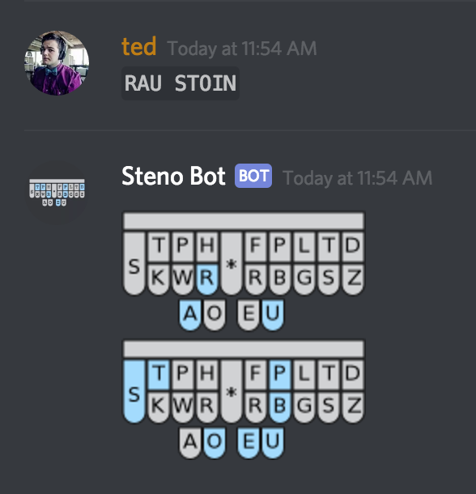

# Steno Bot

This Discord bot reads in messages written in `RAW STENO` and tries to display them graphically. E.g.:

- `RAU STOIN` → `RAU/STOEUPB` (normalization) → to image on node-canvas and uploaded to channel

Each steno layout picture seems to be about 3KB.
